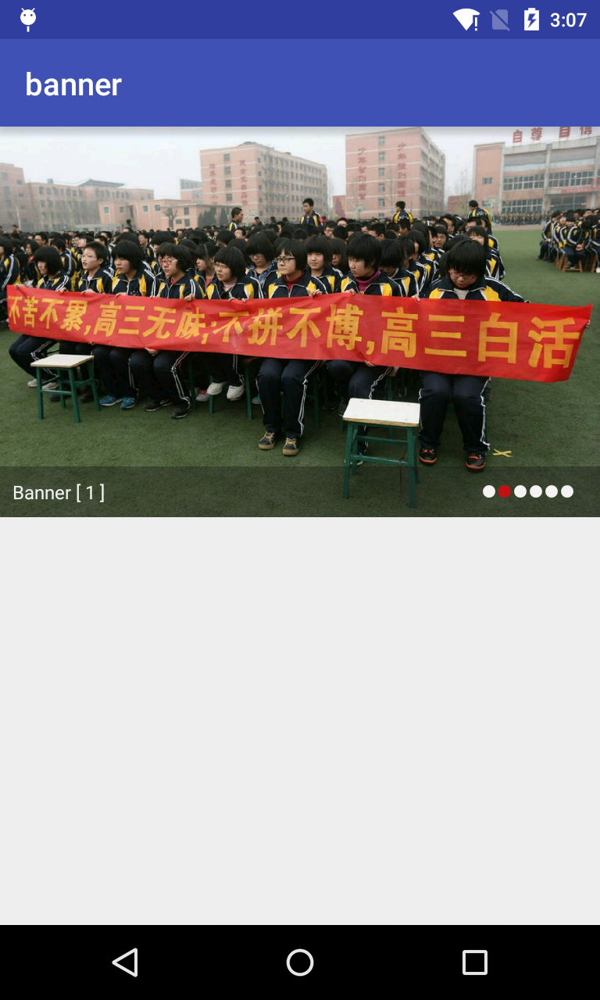

## BannerView 控件介绍

这是一个实现了广告栏的小控件，包含了自动播放、轮播等功能呢！

### 具体使用
``` xml
<?xml version="1.0" encoding="utf-8"?>
<RelativeLayout xmlns:android="http://schemas.android.com/apk/res/android"
    xmlns:tools="http://schemas.android.com/tools"
    android:layout_width="match_parent"
    android:layout_height="match_parent"
    tools:context="cn.isif.plug.banner.MainActivity">

    <fragment
        android:id="@+id/banner"
        android:name="cn.isif.plug.bannerview.BannerView"
        android:layout_width="match_parent"
        android:layout_height="250dp"></fragment>
</RelativeLayout>
```

在已知的Bean类中注册

``` java
package cn.isif.plug.banner.bean;

import cn.isif.plug.bannerview.bean.anno.Banner;

/**
 * Created by dell on 2016/6/6-15:15.
 */
public class BannerTest {

    public String name;
    @Banner("url")
    public String path;
    @Banner("title")
    public String oot;
    public int number;
    public boolean ifs;
}
```
在Activity中
``` java
package cn.isif.plug.banner;

import android.os.Handler;
import android.support.v7.app.AppCompatActivity;
import android.os.Bundle;
import android.view.View;

import java.util.ArrayList;
import java.util.List;

import cn.isif.alibs.utils.log.ALog;
import cn.isif.plug.banner.bean.BannerTest;
import cn.isif.plug.bannerview.BannerView;
import cn.isif.plug.bannerview.exception.ClassTypeException;
import cn.isif.plug.bannerview.listener.OnBannerClickListener;


public class MainActivity extends AppCompatActivity {
    BannerView bannerView = null;
    String[] urls = {"http://upload-images.jianshu.io/upoad_images/1651102-bc70681801c32bc0.jpg", "http://upload-images.jianshu.io/upload_images/912344-9577b0ebf32e4126.jpg"
            , "http://upload-images.jianshu.io/upload_images/1374103-27b82baec4715fe6.jpg", "http://upload-images.jianshu.io/upload_images/2059011-9f6bae280d9631ca.jpg",
            "http://upload-images.jianshu.io/upload_images/1843996-af01025bb4e4ad6e.jpg", "http://p0.so.qhimg.com/t013428ca2e6dfc71c0.jpg"};

    @Override
    protected void onCreate(Bundle savedInstanceState) {
        super.onCreate(savedInstanceState);
        setContentView(R.layout.activity_main);
        bannerView = (BannerView) getFragmentManager().findFragmentById(R.id.banner);
        bannerView.setPool(true);
        bannerView.setAutoWheel(true);
        bannerView.setDelayedTime(5 * 1000);
        bannerView.setOnBannerClickListener(new OnBannerClickListener() {
            @Override
            public void onBannerClickListener(int position, View view) {
                ALog.d("" + position);
            }
        });

        new Handler().postDelayed(new Runnable() {
            @Override
            public void run() {
                try {
                    bannerView.setData(getBannerData());
                } catch (ClassTypeException e) {
                    e.printStackTrace();
                }
            }
        }, 2 * 1000);
    }

    public List<Object> getBannerData() {
        List<Object> bannerBeen = new ArrayList<>();
        int i = 0;
        for (String u : urls) {
            BannerTest bt = new BannerTest();
            bt.oot = "Banner [ " + i + " ]";
            bt.path = u;
            bannerBeen.add(bt);
            i++;
        }
        return bannerBeen;
    }
}

```
最后上一张效果图



